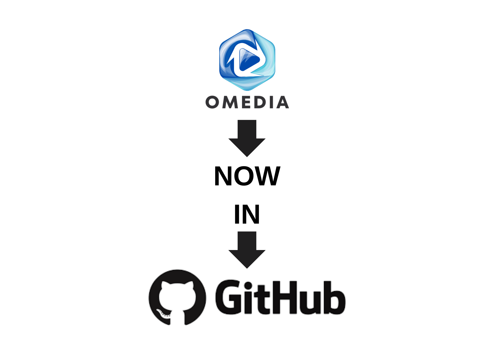

# OMedia

OMedia is an innovative media management project designed to streamline the way you handle your media files. It focuses on providing an intuitive interface and efficient tools to organize, access, and preview media content with ease.

The project aims to simplify media organization, improve workflow, and enhance the overall user experience by offering a clean and user-friendly environment for managing various types of media files.

OMedia is structured to be flexible and extensible, allowing future enhancements and integration of additional features tailored to media management needs.
